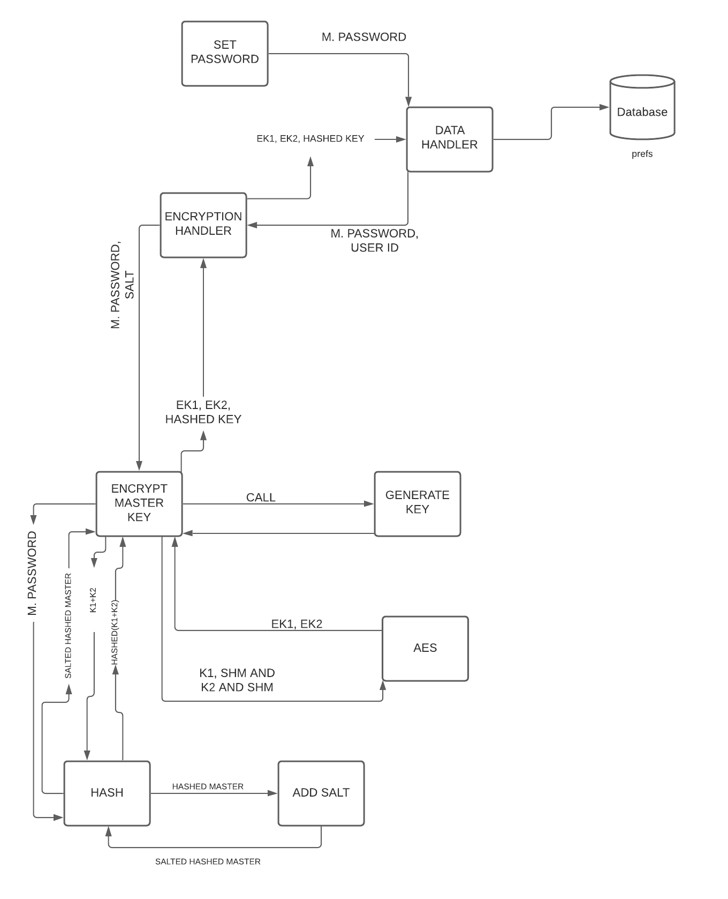

<p align="center">


</p>


<p align="center"><strong>ONE PLACE TO MANAGE ALL YOUR CREDENTIALS</strong></p>

<br>

<p align="center">You and only you have the access to your stored data! 🔒</p>
<p align="center">Access on any device 💻 📱</p>
<p align="center">Advanced Encryption that would take "27 trillion trillion trillion trillion trillion years" for an advanced computer to crack 😲</p>


<br/><br/>

<p align="center">Get Started 🏃</p>
<p align="center"><a href="http://www.xcrypt.ml">http://www.xcrypt.ml</a></p>
<p align="center"><a href="https://play.google.com/store/apps/details?id=com.tanmayhinge.xcrypt">Android App</a></p>


<br/><br/>

## Architecture


## Algorithm



## Project Setup

- ```git clone https://github.com/tanmayhinge/XCRYPT.git```
- ```npm install```
- create a new project at https://console.cloud.google.com/ and add Google Drive and Sheets API to it, and get your keys
- Create a .env file in the root of the project directory and add the following variables without quotes..
    - REACT_APP_API_KEY=YOUR_API_KEY
    - REACT_APP_CLIENT_ID=YOUR_CLIENT_ID
- ```npm start``` 