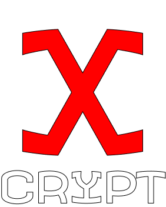
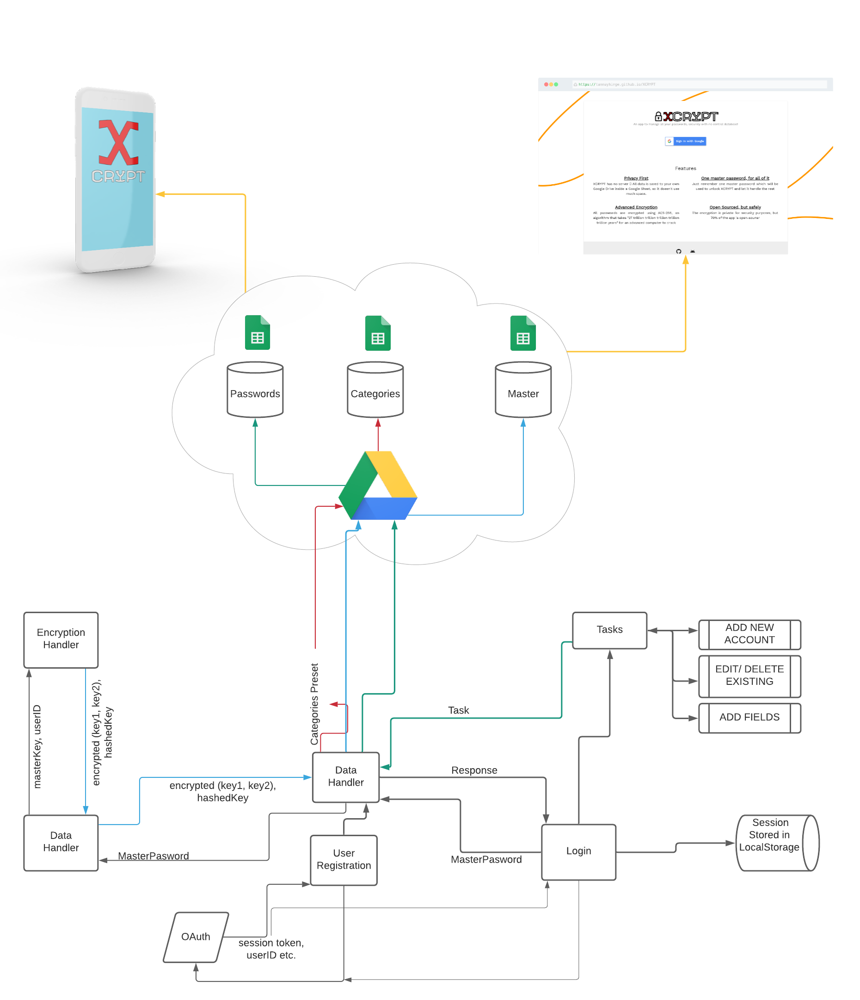

<center>



<h2>ONE PLACE FOR ALL CREDENTIALS</h2>
<p>You and only you have the access to your stored data! 🔒</p>
<p>Access on any device 💻 📱</p>
<p>Advanced Encryption that would take "27 trillion trillion trillion trillion trillion years" for an advanced computer to crack 😲</p>

<br/><br/>

<p>Get Started 🏃</p>
<a href="http://www.xcrypt.ml">http://www.xcrypt.ml</a>

<br/><br/>

<p>Flow Diagram</p>



</center>

---

### Project Setup

- ```git clone https://github.com/tanmayhinge/XCRYPT.git```
- ```npm install```
- create a new project at https://console.cloud.google.com/ and add Google Drive and Sheets API to it...
- Create a .env file in the root of the project directory and add the following variables without quotes..
    - REACT_APP_API_KEY=YOUR_API_KEY
    - REACT_APP_CLIENT_ID=YOUR_CLIENT_ID
- ```npm start``` 